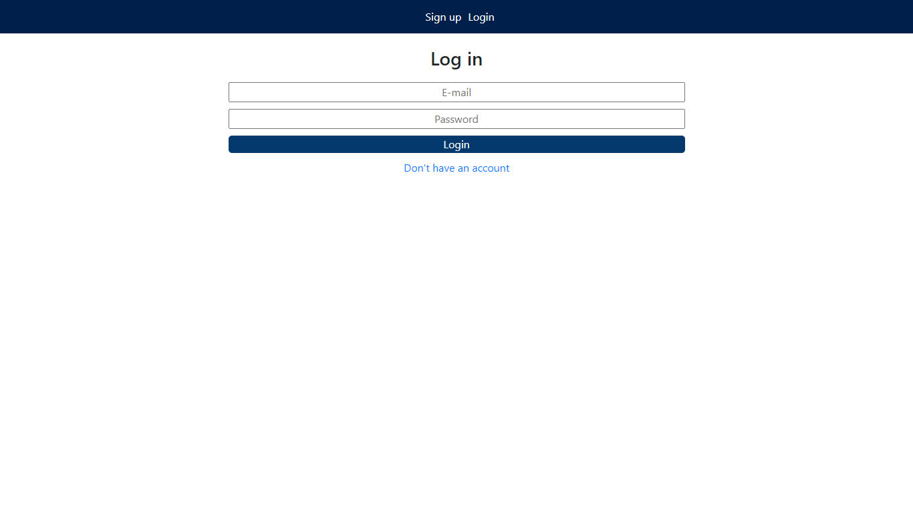

# Appointment App (front end)


## About

In this application, I have an appointment app. The user can choose from a list of 
doctors and choose a date and time to make an appointment with the doctor at that time.

To build this application I used:

- Javascript ES6;
- Html/CSS;
- React;
- Redux;
- React-Redux;
- Jest;
- Create React App;
- React Hooks;
- React Router
- Linters ( eslint and stylelint)

## Live-Demo

[The live demo link](https://reverent-agnesi-e659b2.netlify.app/)

## Link for back-end repository

[Link for back-end repository](https://github.com/RICKCOYL/appointment-back-end.git)

## Screenshots




## Features

- Log in, log out and sign up
- Create appointments;
- Show the list of the appointments of the user;


## Getting started (Feature)

To get a local copy of the repository please run the following commands on your terminal:

```
$ git clone https://github.com/RICKCOYL/appointment-front-end.git
$ cd appointment-front-end
$ git checkout feature

```

## Launch the application

After making the local copy of the repository:
- get inside the repository folder;
- setup the dependencies of the project: in the terminal run: ```npm install```
- enter the command: ```npm start``` to start the server in localhost.
- then you get the application in the localhost in your web browser.

## Test the application

After making the local copy of the repository:
- get inside the repository folder;
- setup the dependencies of the project: in the terminal run: ```npm install```
- enter the command: ```npm run test``` to test the application.
- then you get the application tested.

In this application I test the components using the snapshots .

## Author

👤 **RICK OBURU**

- Github: [@RICKCOYL](https://github.com/RICKCOYL)
- Twitter: [@rickcoyl](https://twitter.com/rickcoyl)
- Linkedin: [Rick Oburu](https://www.linkedin.com/in/rickoburu/)

## 🤝 Contributing

Contributions, issues ,and feature requests are welcome!

## Show your support

Give an ⭐️ if you like this project!

## Acknowledgments

- Hat tip to [stackoverflow](https://stackoverflow.com) community.
- Hat tip to [Microverse](https://www.microverse.org/) TSE for Code Review
- Hat tip to [Create React App](https://github.com/facebook/create-react-app)
- Hat tip to [Heroku](https://www.heroku.com/)
- Hat tip to anyone whose code was used

## Issues
If you would like to report an issue [the link](https://github.com/RICKCOYL/appointment-front-end/issues)

## 📝 License

All source code is available jointly under the MIT License.
See [MIT licence](./LICENSE.md) for details.
